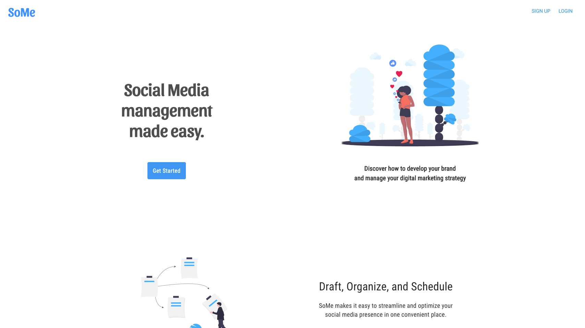
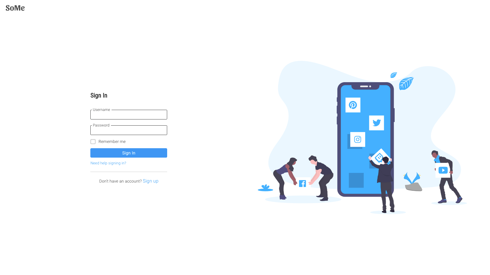
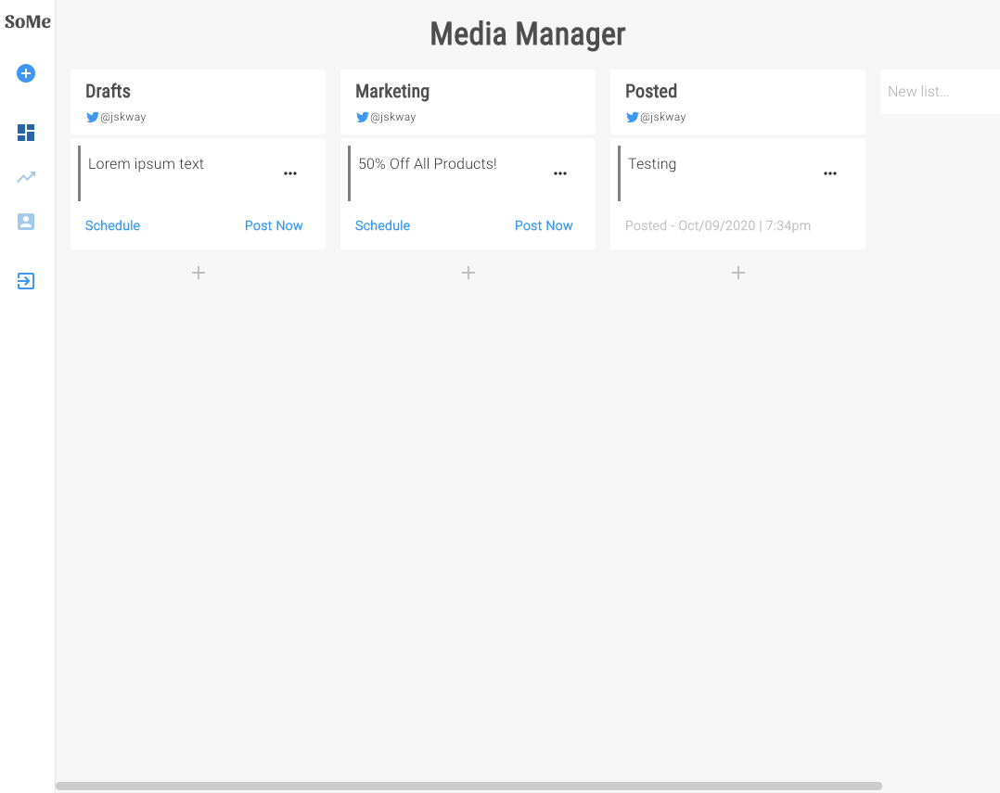
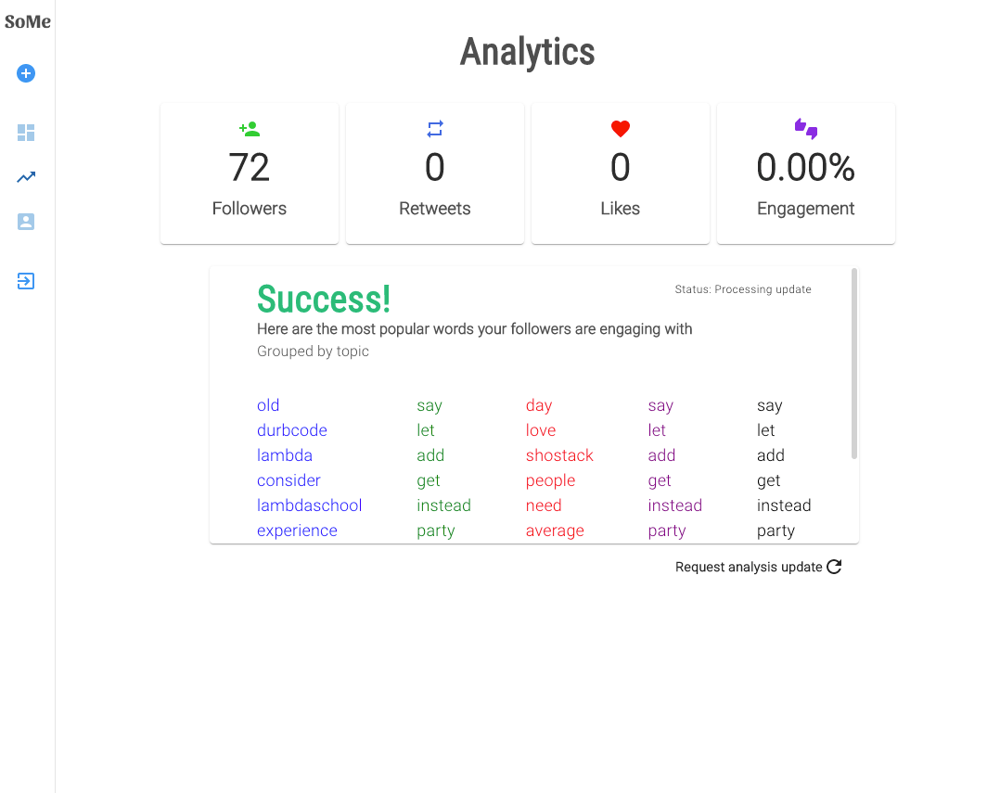

<ProjectWrapper>

## Introduction

  SoMe is a project built during my internship role as a <em>Labs Team Lead</em>{" "}
  at Lambda School.

  SoMe is a web app that makes it easy for users to streamline and optimize
  their social media presence. It was built by a cross-functional team of 3 data
  scientist and 4 web development students.

  My responsibilities included: crafting user stories, planning release cycles,
  coordinating stakeholder meetings, running daily standup meetings, and making
  technical contributions.

<table>
  <tbody>
    <tr>
      <th>Type</th>
      <th>Stack</th>
      <th>Code</th>
      <th>Live</th>
    </tr>
    <tr>
      <td>Team Project</td>
      <td>React</td>
      <td>
        <a href="https://github.com/some-labs-24/front-end" target="_blank">
          View Code
        </a>
      </td>
      <td>
        <a href="https://so-me.app" target="_blank">
          View Site
        </a>
      </td>
    </tr>
    <tr>
      <td></td>
      <td>Redux</td>
      <td></td>
      <td></td>
    </tr>
    <tr>
      <td></td>
      <td>Material-UI</td>
      <td></td>
      <td></td>
    </tr>
    <tr>
      <td></td>
      <td>Express</td>
      <td></td>
      <td></td>
    </tr>
    <tr>
      <td></td>
      <td>PostgreSQL</td>
      <td></td>
      <td></td>
    </tr>
    <tr>
      <td></td>
      <td>Okta</td>
      <td></td>
      <td></td>
    </tr>
    <tr>
      <td></td>
      <td>Jest</td>
      <td></td>
      <td></td>
    </tr>
  </tbody>
</table>

<ImageWrapper>

</ImageWrapper>

## Purpose & Goal

  Lambda School Labs is a 8-week full software engineering apprenticeship built
  into the course that simulates a real-world development workplace. Our goal
  was to deploy a minimum of two new features by completing two Agile
  iterations.

  The first two weeks were spent getting familiar with the team and planning our
  roadmap. During this process, we researched and refined our user personas,
  examined the inherited codebase, met with our stakeholder, and came up with a
  list of features.

  After our planning phase, we ended up with three release canvases (with a two
  week timeframe for each):
  <ol>
    <li>
      Refactor the front and and backend of the existing code base for improved
      maintainability and scalability
    </li>
    <li>Redesign the UI to be more intuitive and modern</li>
    <li>
      Add an analytics dashboard to display the results of our data science
      team's follower engagement analysis
    </li>
  </ol>

<ImageWrapper>

</ImageWrapper>

## Tech Stack

  SoMe's front end is built with React as the UI library, Redux for state
  management, Material-UI as the styling library, and styled-components for
  customized styles.

  The back end is built on a PostgreSQL database for data persistence and
  Express for routing and middleware. The Express router is connected to our
  data science team's API which processes data from the Twitter API. We used
  Okta as our identity provider and Jest for unit testing.

<ImageWrapper>

</ImageWrapper>

## Key Features

<ul>
  <li>
    Draft and organize lists of posts with a intuitive and modern drag-and-drop
    interface
  </li>
  <li>Schedule posts to automatically go out at a specified date and time</li>
  <li>Insights into the words your followers are engaging with most</li>
</ul>

## Problems and Thought Process

  The first challenge we encountered was navigating and comprehending the
  existing codebase. We also discovered that the previous team had exposed their
  private API keys on Github. Security was priority, so we resolved this issue
  first by setting up new keys and making sure to keep our .env file private.

  The next step was refactoring the codebase to improve maintainability and
  scalability. During the process, we found duplication of user account data
  along with issues with the Okta integration. We lacked sufficient knowledge
  about Okta and OAuth2.0, so I found relevant resources and documentation and
  shared my findings with my team to get us up to speed. I learned a ton about
  OAuth flow and managing tokens (from Okta and Twitter).

  The next challenge we faced was redesigning the UI without a designer on our
  team. To get around this, I asked the team to gather images of similar apps
  for design inspiration. And Aja, one of our web team members, volunteered to
  create mockups on Figma. With the redesign, we were able to display a new
  analytics dashboard that integrated with our data science team's API.

  The last challenge was getting adequate test coverage on our codebase. The
  experience I gained from taking Kent C. Dodd's testing course on Front End
  Masters came in handy. I conducted pair-programming sessions with my web team
  members to lead them through the process.

<ImageWrapper>

</ImageWrapper>

## Lessons Learned

  This project helped to reinforce my React and Redux knowledge, such as
  handling async actions or creating mocks for testing. I also learned a ton
  about OAuth 2.0 and how to handle various identity and access tokens.

  In addition to overcoming the technical challenges, I learned a great deal
  about how to lead a team and effectively resolve interpersonal conflicts.

</ProjectWrapper>

