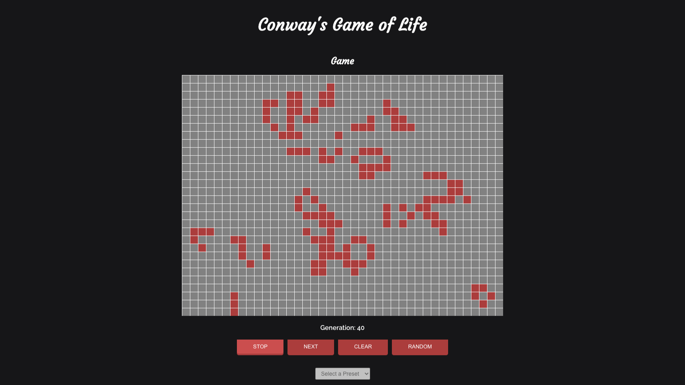

<MDXWrapper>

## Introduction

Game of Life is a React App built for my final project at Lambda School. I
built this project with React and the React Context API. This project required
a lot of thinking and planning about the game's algorithm, animation and
various pieces of state.

<table>
  <tbody>
    <tr>
      <th>Type</th>
      <th>Stack</th>
      <th>Code</th>
      <th>Live</th>
    </tr>
    <tr>
      <td>Solo Project</td>
      <td>React</td>
      <td>
        <a href="https://github.com/jskway/game-of-life" target="_blank">
          View Code
        </a>
      </td>
      <td>
        <a href="https://gameoflife-jsk.netlify.app/" target="_blank">
          View Site
        </a>
      </td>
    </tr>
    <tr>
      <td></td>
      <td>React Context API</td>
      <td></td>
      <td></td>
    </tr>
  </tbody>
</table>

<ImageWrapper>

</ImageWrapper>

## Purpose & Goal

The goal of this project was to meet all of the <a href="https://github.com/LambdaSchool/CS-Build-Week-1#mvp-features" target="_blank"> project requirements. </a>
I had a timeframe of two weeks to complete this project starting from scratch.

<ImageWrapper>

</ImageWrapper>

## Tech Stack

Game of Life is built with React as the UI library, React Context for state management, plain CSS for styling, and Netlify for deployment.

## Key Features

- Grid of cells that can be toggled to be _alive_ or _dead_
- Buttons to start / stop the animation and clear the grid
- 1 random and 3 preset cell configurations
- Ability to set the speed of the simulation

## Problems and Thought Process

The first step I took was to create a basic wireframe to lay out how the app
should look. Given the minimal amount of content, a sketch on my notepad was
sufficient.

The next step was breaking down my sketch into different components:
_About, Cell, Controls, Grid, and Rules_. After initializing the
codebase with these components,
I added some basic styles and wrote the text
content.

With the structure of the app in place, the next challenge was planning the
state management. To avoid prop drilling, I relied on React's Context API. I
ended up with three different pieces of global states: the grid size, the grid
cells, and live cells.

The biggest and final challenge was writing the algorithm that examines the
state of the cells and applies the rules of the game to update the state. This
was heavily tied to planning the state management as well. Ultimately, I
overcame this challenge out by breaking down each step and walking through the
algorithm with pen and paper.

<ImageWrapper>

</ImageWrapper>

## Lessons Learned

This project helped to reinforce my React knowledge, especially around state
management. It also improved my problem solving skills. I learned how to break
down complex problems into smaller sub-tasks to really understand the essence
of the issue.

</MDXWrapper>

